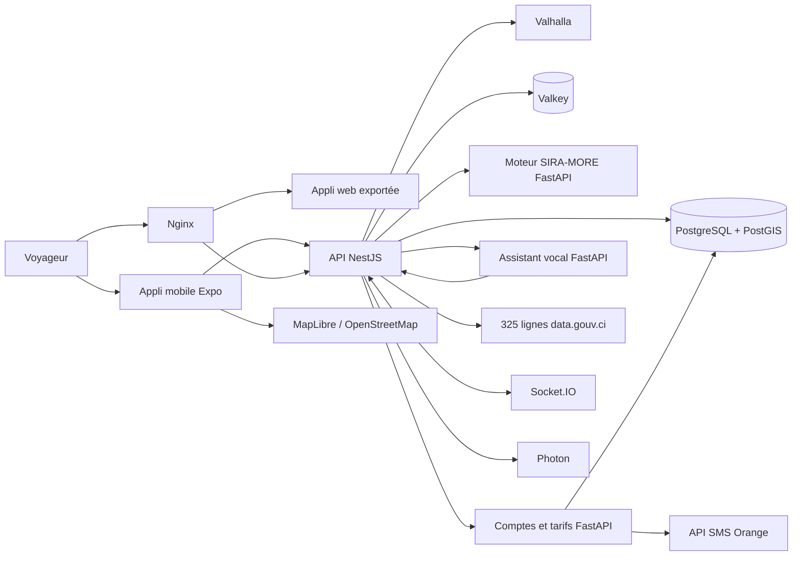

# Architecture technique de SIRA

Ce document regroupe les détails techniques. Pour démarrer, lire d'abord le [README](../README.md).

## Vue d'ensemble



## Services et ports

| Service | Port local | Rôle | Dossier |
| --- | ---: | --- | --- |
| Application mobile | 8081 | écrans du voyageur (Expo : navigateur et Expo Go) | `mobile/` |
| API | 4000 | seule porte d'entrée : trajets, signalements, relais vers les comptes et la voix | `services/api/` |
| Moteur SIRA-MORE | 8000 | classement explicable des trajets (privé, appelé par l'API) | `services/engine/` |
| Comptes et tarifs | 8100 | connexion par code SMS, prix confirmés par les voyageurs | `services/community/` |
| Assistant vocal | 8200 | voix → texte → compréhension fr-CI → trajet → réponse vocale, FAQ | `services/voice/` |
| Modèles d'IA | — | Whisper, CamemBERT fr-CI, Piper (hors Git) | `services/models/` |
| Nginx | 8080 | seul point public de la stack Podman : appli web exportée, `/api/`, `/socket.io/` | `infra/nginx/` |
| Valhalla | 8002 (machine seule) | marche et route sur OpenStreetMap | `infra/compose.yaml` |
| PostgreSQL/PostGIS | 5432 (machine seule) | données géospatiales, comptes | `infra/database/` |
| Valkey | 6379 interne | cache et état temps réel | `infra/compose.yaml` |

## Endpoints principaux (API, préfixe `/api/v1`)

- `GET /health`
- `GET /mobility/search?q=plateau` : recherche de lieux (Photon)
- `GET /mobility/reverse?lat=…&lon=…` : nom du lieu le plus proche
- `POST /mobility/journeys` : calcul des trajets ; accepte `departureAt` et `avoid: [{ lat, lon, radiusM }]`
- `GET /reports`, `POST /reports` (`type`, `lat`, `lon`, `location`, `description`, `clientId`)
- `POST /reports/:id/confirm` et `POST /reports/:id/contest` (`clientId`)
- `POST /reports/impact` : incidents confirmés à moins de 150 m d'un trajet et retard estimé
- `POST /auth/request-otp`, `POST /auth/verify-otp`, `GET /auth/me`, `PATCH /users/me` : comptes (relayés vers le port 8100)
- `GET /fares?line_id=…`, `POST /fares/reports` : tarifs communautaires
- Socket.IO : namespace `/traffic`, événements `traffic.report.created` et `traffic.report.updated`
- Voix (relayées vers le port 8200) : `POST /voice/query` (audio multipart), `POST /voice/ask` et `POST /voice/understand` (texte), `POST /voice/tts`, `GET /voice/health`, page de test `GET /voice/page`
- Moteur : `POST /v1/recommendations/rank` ; documentation locale `http://localhost:8000/docs`

Exemple de calcul :

```json
{
  "origin": { "lat": 5.3467, "lon": -3.9951, "name": "Cocody Danga" },
  "destination": { "lat": 5.3196, "lon": -4.0201, "name": "Plateau Gare Sud" },
  "preference": "balanced",
  "constraints": { "maxWalkingDistanceM": 1500, "maxTransfers": 3, "excludedModes": [] }
}
```

## Moteur de trajets

- Graphe construit sur 325 lignes historiques (SOTRA, gbaka, wôrô-wôrô, bateaux-bus), environ 18 900 nœuds.
- Une correspondance entre deux lignes est admise jusqu'à 350 m, puis confirmée à pied par Valhalla.
- Une ligne fermée à l'heure demandée (horaires historiques) est exclue.
- Pour chaque tronçon, les autres lignes qui desservent les mêmes arrêts sont listées (« 15 / 203 »).
- Attente médiane = moitié de l'intervalle déclaré, P90 = 90 % ; durées et tarifs estimés avec leur méthode, leur P90 et leur confiance.
- SIRA-MORE : contraintes strictes, frontière de Pareto, diversité, score, explications, puis catégories **Coulé** (moins cher), **Debout** (juste milieu) et **Suspendu** (confort).
- SIRA-MORE est obligatoire : si le moteur est arrêté, l'API renvoie une erreur explicite. Secours volontaire seulement avec `SIRA_ALLOW_RANKING_FALLBACK=true`.
- Sans Valhalla, les accès et correspondances à pied ne peuvent pas être confirmés ; pour des essais seulement, `SIRA_ALLOW_ESTIMATED_WALK_CONNECTORS=true`.

## Données

- Source : `https://data.gouv.ci/datasets/abidjantransport-lignes` (licence ouverte), mise à jour d'octobre 2021.
- `data/processed/` : données prêtes pour le moteur ; `data/raw/` : source brute ; `data/pilot/` : jeux de non-régression ; `data/gtfs-demo/` : GTFS pilote.
- Horaires, attentes, durées et tarifs restent des estimations à valider avec les opérateurs.
- Voir aussi [l'audit des données](PHASE1_DATA_AUDIT.md), [le routage PostGIS](routing-postgis.md) et [l'import PostGIS](transport-postgis.md).

## Stack complète avec Podman

```bash
# 1. Exporter l'appli web avec l'adresse COMPLÈTE de l'API (elle sert aussi aux signalements en direct)
cd mobile && EXPO_PUBLIC_API_URL=https://<domaine>/api/v1 npx expo export -p web && cd ..
# 2. Lancer la stack (API, SIRA-MORE, comptes, voix, PostGIS, Valkey, Valhalla, Nginx) → http://localhost:8080
podman compose -f infra/compose.yaml up --build -d
npm run test:routing:live                      # contrôle réel des accès piétons une fois Valhalla prêt
```

Au premier lancement, Valhalla télécharge l'OpenStreetMap de Côte d'Ivoire (jusqu'à 20 min). Seul Nginx (8080) est
ouvert au réseau ; PostgreSQL et Valhalla ne sont joignables que depuis la machine elle-même (outils d'import, tests).

## Sécurité

**CORS (navigateurs)** : une seule règle pour l'API HTTP et Socket.IO, dans `services/api/src/cors.ts`.

| Mode | Origines acceptées |
| --- | --- |
| Développement (`SIRA_ENV` absent ou `development`) | la liste `CORS_ORIGIN` ; `http(s)://<hôte>:8081` et `:8082` (Expo) quand l'hôte est `localhost`, `127.x` ou une IP privée (`10.x`, `172.16–31.x`, `192.168.x`) ; `https://*.trycloudflare.com` (`npm run dev:tunnel`) |
| Production (tout autre `SIRA_ENV`) | **uniquement** la liste `CORS_ORIGIN` ; liste vide = toutes les origines navigateur refusées (message au démarrage) |

Les requêtes sans en-tête `Origin` (Expo Go natif, curl, service vocal) ne sont pas concernées. Les services
internes (SIRA-MORE 8000, comptes 8100, voix 8200) écoutent sur `127.0.0.1` : un téléphone ne joint que l'API (4000).
En production, `SIRA_ENV=production` est transmis à l'API comme au service des comptes (`infra/compose.yaml`).


- Aucun secret dans le dépôt : `.env` n'est pas versionné, `.env.example` ne contient que les noms de variables.
- `COMMUNITY_JWT_SECRET` est obligatoire en production et le mode démo SMS y est refusé.
- Les branches `AKA` et `BANATOU` contiennent dans leur historique des identifiants et des données personnelles : les clés doivent être régénérées.

## Limites connues du MVP

- Signalements gardés en mémoire par l'API (perdus au redémarrage).
- Retards liés aux incidents : valeurs-types par catégorie.
- Données ouvertes de 2021 : le transport informel demande une collecte terrain.
- OpenFreeMap et le Valhalla public n'ont pas de garantie de service : prévoir un hébergement pour la production.

## Attributions

Carte MapLibre GL et OpenFreeMap, données OpenStreetMap, routage Valhalla, transports modélisés selon GTFS Schedule.
